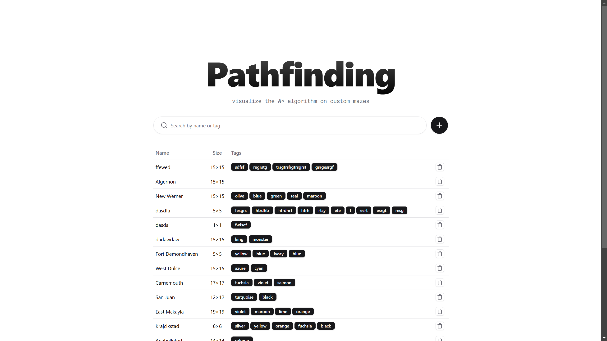
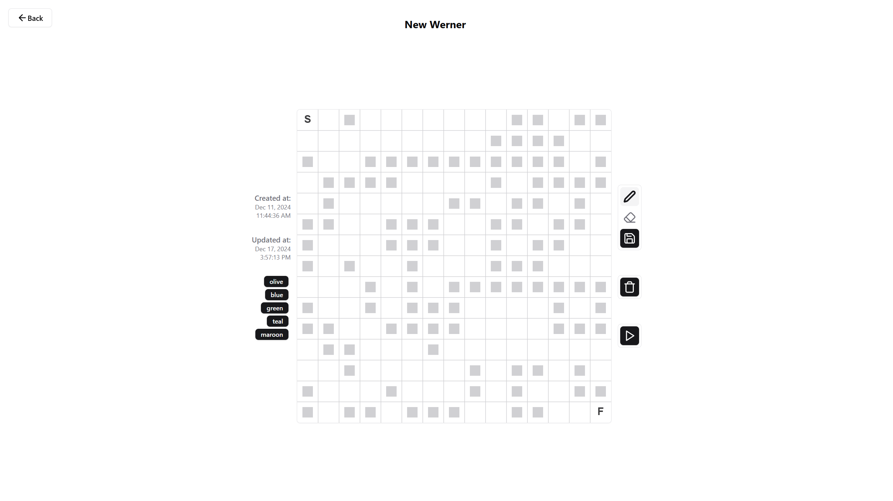
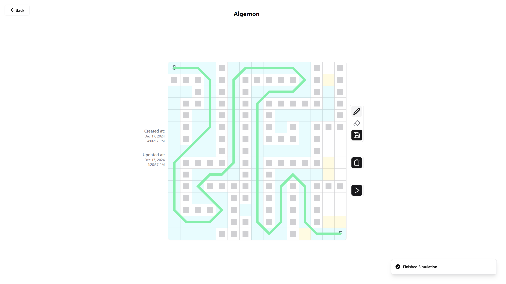

# 🗺️ pathfinding

A **CRUD** application made with _SvelteKit_ for visualizing the \*A\*\* algorithm on customizable mazes. Originally made for my MMSU CS116 & CS131 Project.

<div align="center">
	
	
	
</div>

## Setup

### Installation

Install the latest _NodeJS_ LTS version from the [official website](https://nodejs.org/en) or through Node Version Manager: [`nvm` for Linux](https://github.com/nvm-sh/nvm), and [`nvm-win` for Windows](https://github.com/coreybutler/nvm-windows).

Afterwards, install dependencies (preferably `pnpm`) with the following commands:

```
npm install -g pnpm
pnpm install
```

### Docker (for development)

_Docker Compose_ is used to run necessary third-party services such as _PostgreSQL_ for development. Install _Docker Desktop_ from the [offical website](https://docs.docker.com/desktop/) to start.

```bash
# start containers
docker-compose up -d

# stop containers
docker-compose stop

# delete containers (--volumes is optional if you also want to remove data volumes)
docker-compose down --volumes
```

## Development

### Database Migration

The project lacks a Database Migration Framework for automatically syncing schemas. In order to setup the database schema for this project, a simple script can be used instead whicn can be executed with the following command.

```
pnpm vite-node "./src/lib/server/migrations/migrate"
```

### Development Server

Start the development server with the following command.

```
pnpm run dev
```
